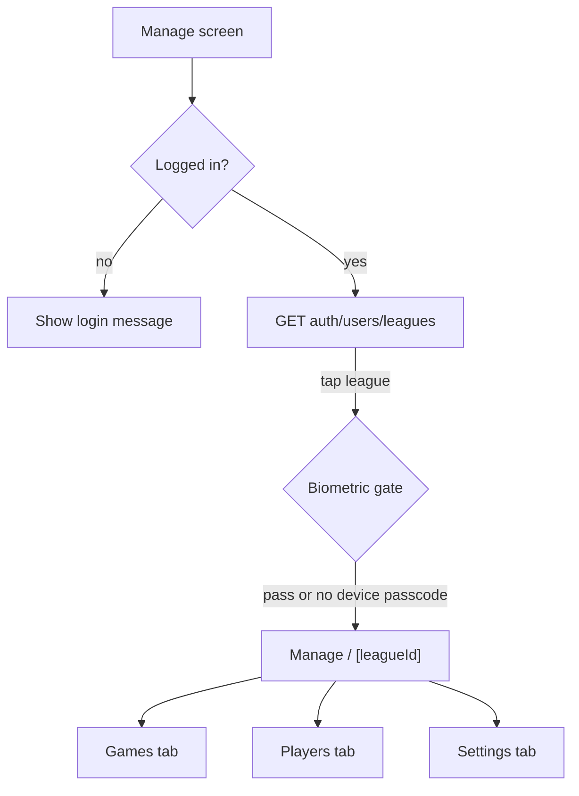

# Manage League — React Native integration guide

This document describes the **Manage** flow for league owners: screens, tabs, API calls, and client-side rules. It aligns with the product spec and the current backend in [ROUTES.md](../ROUTES.md).

**Related docs**

- Auth tokens: [MOBILE_AUTH_ROUTES.md](../MOBILE_AUTH_ROUTES.md)
- Player invites: [PLAYER_INVITE.md](./PLAYER_INVITE.md)
- Match-day timezone (public feed only): [TIME_AND_TIMEZONE.md](./TIME_AND_TIMEZONE.md)

---

## Response conventions

| Pattern       | Meaning                                                                                     |
| ------------- | ------------------------------------------------------------------------------------------- |
| `{ data: T }` | Most `GET` routes that use `serialize()`                                                    |
| Plain JSON    | Many `POST`/`PUT`/`DELETE` mutations return `{ message: "..." }` without a `data` wrapper   |
| Bearer token  | Send `Authorization: Bearer <token>` on all manage routes (except public reads noted below) |

Base URL: your API host + `/api/v1`.

---

## Navigation overview



### 1. Manage list (`/manage`)

**Purpose:** Show leagues the current user **owns** so they can open the admin console.

| Step         | Action                                                                                                                                                                   |
| ------------ | ------------------------------------------------------------------------------------------------------------------------------------------------------------------------ |
| Auth check   | If no stored Bearer token → show _“Log in to view your leagues”_ and link to login (`POST /api/v1/auth/login`). Optional: `GET /api/v1/auth/users/me` to validate token. |
| Load leagues | `GET /api/v1/auth/users/leagues`                                                                                                                                         |

**Response shape:**

```json
{
  "data": [
    {
      "id": 10,
      "name": "Sunday Riverside League",
      "logoUrl": null,
      "countryId": 1,
      "activeSeason": { "id": 5, "name": "2026 — Spring", "status": "active" }
    }
  ]
}
```

**UI:** List of leagues (name, logo). Tapping a row navigates to manage detail for that `leagueId`.

### 2. Biometric gate (client only)

Before entering `manage/[leagueId]`, prompt for **Face ID / Touch ID / device PIN** if available.

| Case                                     | Behavior                                         |
| ---------------------------------------- | ------------------------------------------------ |
| Biometrics available and succeed         | Navigate to manage detail                        |
| User cancels                             | Stay on league list                              |
| No device passcode/biometrics configured | **Allow access** without gate (per product rule) |

No API call for this step.

### 3. Manage detail (`/manage/[leagueId]`)

**Shared state for all tabs:**

| State       | Source         | Notes                                       |
| ----------- | -------------- | ------------------------------------------- |
| `leagueId`  | Route param    |                                             |
| `seasonId`  | Season picker  | From `seasons[]` on league detail load      |
| `season`    | League detail  | Games, standings, stats for selected season |
| `statTypes` | League detail  | Event labels for Match Center               |
| `teams`     | Teams endpoint | For forms and pickers                       |

**Initial load (on mount + when season changes):**

```
GET /api/v1/leagues/:leagueId?seasonId={seasonId}
```

Returns `{ data: { seasons, season, statTypes } }`. See [ROUTES.md — league show](../ROUTES.md).

**Teams (for Add Game / invite pickers):**

```
GET /api/v1/auth/users/leagues/:leagueId/teams
```

Returns `{ data: Team[] }` — `id`, `name`, `logoUrl`. Only works if the user owns the league.

**Season picker:** Use `data.seasons` from league show. Default `seasonId` = active season if present, else newest. **Past seasons are read-only for settings** (no edit season API); games/players still work per season.

---

## Tab: Games

Three sections on the Games tab, driven by **`season.games`** from league show. Partition client-side by `game.status`:

| Section      | `status` values                                                  |
| ------------ | ---------------------------------------------------------------- |
| **Live Now** | `first_half`, `second_half`, `extra_time`, `half_time`, `paused` |
| **Upcoming** | `scheduled`, `postponed`                                         |
| **Results**  | `full_time`, `cancelled`                                         |

Sort within each section by `playedAt` ascending (upcoming/live) or descending (results), as you prefer.

### Add Game form

Schedule a new match for the **selected season**.

```
POST /api/v1/leagues/games
Authorization: Bearer …
Content-Type: application/json
```

| Field                                     | Required | Notes                         |
| ----------------------------------------- | -------- | ----------------------------- |
| `leagueId`                                | yes      | Current league                |
| `seasonId`                                | yes      | Selected season               |
| `homeTeamId`                              | yes      | From teams list               |
| `awayTeamId`                              | yes      | From teams list               |
| `playedAt`                                | yes      | ISO 8601 or `YYYY-MM-DD`      |
| `venueName`                               | no       |                               |
| `status`                                  | no       | Default `scheduled`           |
| `firstHalfDuration`, `secondHalfDuration` | no       | Default `45` each             |
| `extraTimeDuration`                       | no       | Optional                      |
| `homeScore`, `awayScore`                  | no       | Usually null for new fixtures |

After success, refetch `GET /leagues/:leagueId?seasonId=…`.

### Live Now — open Match Center

Tap a live game → full-screen **Live Match Center** (busy-admin UI).

**Load / refresh:**

```
GET /api/v1/games/:id
```

Returns game + `stats[]` (with `type`, `team`, `player`, `relatedPlayer`) + `league`.

**Optional realtime:** Backend broadcasts on Transmit channel `games/{gameId}` when scores or stats change. Subscribe if you use SSE in RN.

#### Scoreboard (hybrid scoring)

Use **`+` / `−`** per side — score and unaccredited goal stat stay in sync. See [hybrid-scoring-prompt.md](hybrid-scoring-prompt.md).

| Action          | API                                                                                                                      |
| --------------- | ------------------------------------------------------------------------------------------------------------------------ |
| Increment score | `POST /api/v1/games/:gameId/score` `{ "team": "home" \| "away", "action": "increment" }` → returns `statId` for accredit |
| Decrement score | `POST .../score` `{ "action": "decrement" }` — removes latest unaccredited goal for that team                            |
| Accredit goal   | `PATCH /api/v1/games/:gameId/stats/:statId/accredit` `{ playerId, assistPlayerId?, isOwnGoal, minute }`                  |
| Skip accredit   | No API — placeholder already created on increment; reset UI only                                                         |

**SSE:** `score_updated` (scores), `stat_accredited` (refetch stats).

Legacy manual score: `PUT /api/v1/leagues/games/:id` with `homeScore` / `awayScore` still works for league owners.

#### Match controls

Live match clock uses **period timestamps** (not DB minute polling). See [CHANGE_GAME.md](CHANGE_GAME.md).

| Action                 | API                                                                     |
| ---------------------- | ----------------------------------------------------------------------- |
| Start first half       | `POST /api/v1/games/:gameId/start-first-half`                           |
| Half time              | `POST /api/v1/games/:gameId/half-time`                                  |
| Start second half      | `POST /api/v1/games/:gameId/start-second-half`                          |
| Extra time             | `POST /api/v1/games/:gameId/extra-time`                                 |
| Pause                  | `POST /api/v1/games/:gameId/pause`                                      |
| Resume                 | `POST /api/v1/games/:gameId/resume`                                     |
| Full time (with score) | `POST /api/v1/games/:gameId/full-time` → `{ "homeScore", "awayScore" }` |

All game-time routes require **`apiAuth` + `teamOwner`** (league owner or either team's `addedBy` user). Each action broadcasts SSE `status_changed` on `games/{gameId}`.

| Action              | API                                                                                            |
| ------------------- | ---------------------------------------------------------------------------------------------- |
| Undo last event     | `DELETE /leagues/stats/:id` (delete the most recent stat row; adjust score manually if needed) |
| Delete single event | `DELETE /leagues/stats/:id`                                                                    |

#### Recording an event (Auto)

```
POST /api/v1/leagues/stats
```

| Field                      | Notes                                                       |
| -------------------------- | ----------------------------------------------------------- |
| `gameId`                   | Current game                                                |
| `leagueId`, `seasonId`     | From game / manage context                                  |
| `teamId`                   | Side the player represents in **this** match (home or away) |
| `playerId`                 | Scorer / card recipient                                     |
| `statTypeId`               | From `statTypes` — map UI label → `name` below              |
| `relatedPlayerId`          | Assists only — assisting player                             |
| `minute`, `isStoppageTime` | Optional                                                    |

**Stat type mapping** (`statTypes[].name` → UI):

| UI label | `name`        | Score impact (client)    |
| -------- | ------------- | ------------------------ |
| Goal     | `goals`       | +1 for `teamId` side     |
| Own Goal | `own_goal`    | +1 for **opposite** side |
| Assist   | `assists`     | No score change          |
| Yellow   | `yellow_card` | No score change          |
| Red      | `red_card`    | No score change          |

Backend validates: player has **active** roster row for `teamId` in this league/season, and `teamId` is home or away in this game. Returns `422` if not.

#### Recent events feed

Use `GET /games/:id` → `stats[]`. Show `type.displayName`, player name, team name, minute. Newest first recommended.

### Upcoming

| Action    | API                                                                      |
| --------- | ------------------------------------------------------------------------ |
| **Start** | `POST /api/v1/games/:gameId/start-first-half` → navigate to Match Center |

### Results (full time)

| Action            | API                                                                        |
| ----------------- | -------------------------------------------------------------------------- |
| Edit score inline | `PUT /leagues/games/:id` `{ "homeScore", "awayScore" }`                    |
| Reopen match      | `POST /api/v1/games/:gameId/start-first-half` or set `scheduled` via `PUT` |
| Delete            | `DELETE /leagues/games/:id`                                                |

---

## Tab: Players

Manage the **season roster** via invites (no manual player creation). See [PLAYER_INVITE.md](./PLAYER_INVITE.md).

### Load roster

```
GET /api/v1/leagues/:leagueId/seasons/:seasonId/roster
```

**Response:** `{ data: LeaguePlayerWithPlayer[] }`

Each item includes:

| Field                       | Description                                                 |
| --------------------------- | ----------------------------------------------------------- |
| `id`                        | `league_players` row id (for update/delete)                 |
| `status`                    | `active`, `pending`, etc.                                   |
| `position`                  | `attack` \| `defence` \| `midfield` \| `goalkeeper` \| null |
| `jerseyNumber`, `isCaptain` |                                                             |
| `player`                    | `{ id, name, avatarUrl }`                                   |
| `team`                      | `{ id, name, logoUrl }`                                     |

Refetch when season changes or after invite/roster mutations.

### Flow A — Invite a specific user

1. Search: `GET /api/v1/auth/users/search?q={query}&leagueId={leagueId}`
2. User picks league, season, team (season from picker; teams from auth users teams endpoint).
3. Generate link:
   ```
   GET /api/v1/invites/generate?leagueId=&seasonId=&teamId=&invitedUserId={userId}
   ```
   Response: `{ inviteLink: "…" }` (not wrapped in `data`).
4. Share link (WhatsApp, SMS, etc.).
5. Invitee flow (their app): `GET /invites/accept/:token` → maybe `POST /invites/complete-profile-and-accept/:token` with `{ name, bio? }`.

### Flow B — General invite link

Same as Flow A but **omit** `invitedUserId`:

```
GET /api/v1/invites/generate?leagueId=&seasonId=&teamId=
```

Anyone with the link can sign up / log in and join that team for the season.

### Edit roster row

Update jersey, position, captain, status:

```
PUT /api/v1/leagues/league-players/:id
```

Body (all optional): `jerseyNumber`, `position`, `isCaptain`, `status`, `joinedAt`, `leftAt`.

### Remove from roster

```
DELETE /api/v1/leagues/league-players/:id
```

### Direct assign (optional)

If you already have a `playerId` (rare for invite-only product):

```
POST /api/v1/leagues/assign-team
```

Body: `leagueId`, `seasonId`, `teamId`, `playerId`, optional `position`, `jerseyNumber`, `isCaptain`, `status`.

---

## Tab: Settings

### Edit league info

Update name, description, gender, logo for the **league** (not the season).

```
PUT /api/v1/leagues/:leagueId
Content-Type: multipart/form-data or JSON per validator
```

Fields: `name`, `description`, `gender`, `logo` (optional image). See [ROUTES.md](../ROUTES.md).

**Note:** There is no API to rename or change status of an **existing** season. Only **add** seasons.

### Add new season

```
POST /api/v1/leagues/:leagueId/seasons
```

| Field      | Values                                |
| ---------- | ------------------------------------- |
| `leagueId` | From URL / body                       |
| `name`     | e.g. `"2027 — Spring"`                |
| `status`   | `inactive` \| `active` \| `completed` |

Response `201`: raw season object (not wrapped in `data`). After create, refetch league show and switch picker to the new season if desired.

---

## API quick reference (manage)

| Screen / action              | Method   | Path                                                 |
| ---------------------------- | -------- | ---------------------------------------------------- |
| Am I logged in?              | `GET`    | `/api/v1/auth/users/me`                              |
| My leagues                   | `GET`    | `/api/v1/auth/users/leagues`                         |
| Teams in league              | `GET`    | `/api/v1/auth/users/leagues/:leagueId/teams`         |
| League + season detail       | `GET`    | `/api/v1/leagues/:leagueId?seasonId=`                |
| Game detail (Match Center)   | `GET`    | `/api/v1/games/:id`                                  |
| Schedule game                | `POST`   | `/api/v1/leagues/games`                              |
| Update game / score / status | `PUT`    | `/api/v1/leagues/games/:id`                          |
| Delete game                  | `DELETE` | `/api/v1/leagues/games/:id`                          |
| Add stat                     | `POST`   | `/api/v1/leagues/stats`                              |
| Delete stat                  | `DELETE` | `/api/v1/leagues/stats/:id`                          |
| Roster                       | `GET`    | `/api/v1/leagues/:leagueId/seasons/:seasonId/roster` |
| Update roster                | `PUT`    | `/api/v1/leagues/league-players/:id`                 |
| Remove roster                | `DELETE` | `/api/v1/leagues/league-players/:id`                 |
| Search users (invite A)      | `GET`    | `/api/v1/auth/users/search`                          |
| Generate invite              | `GET`    | `/api/v1/invites/generate`                           |
| Update league                | `PUT`    | `/api/v1/leagues/:leagueId`                          |
| Add season                   | `POST`   | `/api/v1/leagues/:leagueId/seasons`                  |

All mutation routes except invite accept require **`apiAuth` + league owner** (user must own the league).

---

## Error handling (RN)

| HTTP  | Typical cause                  | UX                             |
| ----- | ------------------------------ | ------------------------------ |
| `401` | Missing/expired token          | Redirect to login              |
| `403` | Not league owner               | “You can’t manage this league” |
| `404` | Bad id / expired invite        | Not found message              |
| `409` | Already on roster / duplicate  | Show server message            |
| `422` | Validation (stat roster, body) | Show field errors / message    |

---

## Suggested screen checklist

- [ ] Manage list: login gate + `GET auth/users/leagues`
- [ ] Biometric gate before `manage/[id]`
- [ ] Season picker bound to `seasons[]`
- [ ] Games: Live / Upcoming / Results sections
- [ ] Add Game form → `POST leagues/games`
- [ ] Match Center: Auto events + manual score + `PUT` game
- [ ] Match Center: undo/delete stat, end match
- [ ] Players: roster list + invite A/B + edit/remove
- [ ] Settings: edit league + add season only (no edit season)

---

## TypeScript-friendly enums (copy into app)

```ts
export const GameStatus = {
  Scheduled: "scheduled",
  FirstHalf: "first_half",
  HalfTime: "half_time",
  SecondHalf: "second_half",
  ExtraTime: "extra_time",
  FullTime: "full_time",
  Paused: "paused",
  Postponed: "postponed",
  Cancelled: "cancelled",
} as const;

export const SeasonStatus = {
  Inactive: "inactive",
  Active: "active",
  Completed: "completed",
} as const;

export const RosterPosition = {
  Attack: "attack",
  Defence: "defence",
  Midfield: "midfield",
  Goalkeeper: "goalkeeper",
} as const;

/** Map statTypes[].name to Match Center actions */
export const MatchEventStatName = {
  Goal: "goals",
  Assist: "assists",
  OwnGoal: "own_goal",
  Yellow: "yellow_card",
  Red: "red_card",
} as const;
```
