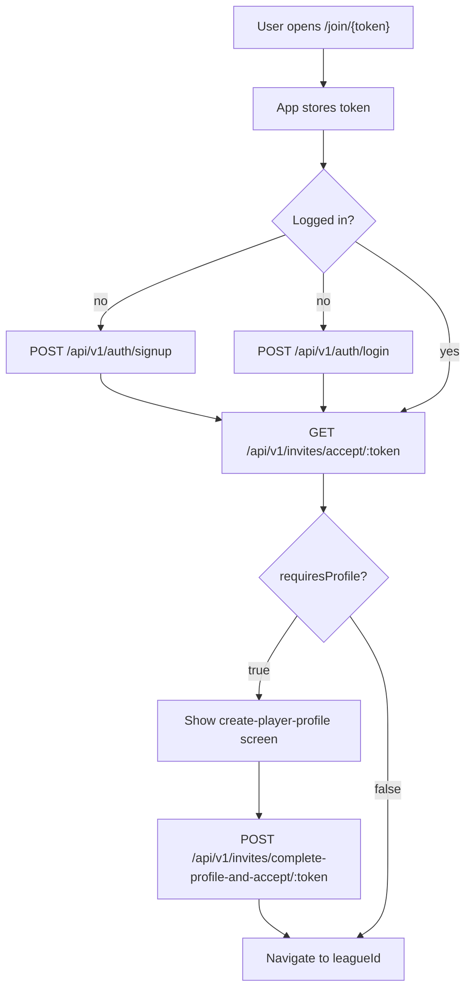

# Player invites

How league owners invite players and how the mobile app must wire signup, profile creation, and roster joining. See [ROUTES.md](../ROUTES.md) for full request/response shapes and [MANAGE_LEAGUE.md](./MANAGE_LEAGUE.md) for the admin Players tab.

**Related:** [MOBILE_AUTH_ROUTES.md](../MOBILE_AUTH_ROUTES.md) — signup/login tokens.

---

## Core rules

1. A **player profile** cannot exist without a **user account**.
2. Admins **cannot** manually create players — they generate invite links only.
3. The **user** creates their own player profile (display name, optional bio) during invite acceptance.
4. **`POST /api/v1/auth/signup` does not join a league.** Signup only creates a `users` row and returns a Bearer token. The app must call the invite accept endpoints afterward.

---

## Flow A — Admin invites a specific user

1. Admin searches: `GET /api/v1/auth/users/search?q=&leagueId=`
2. Admin picks user, season, team → generates link with `invitedUserId`
3. System stores invite: `token` + `leagueId` + `seasonId` + `teamId` + `invitedUserId`
4. Admin shares link with that user
5. User opens link → signs up or logs in
6. App calls accept endpoints (see [Invitee app flow](#invitee-app-flow-react-native))
7. If no player profile yet → profile form → then roster join
8. Done: `players` row + `league_players` row; invite marked `accepted`

Only the user whose `id` matches `invitedUserId` can accept. Anyone else gets `403`.

---

## Flow B — General invite link

Same as Flow A, but **omit** `invitedUserId` when generating the link. Anyone authenticated can accept (first successful accept consumes the token — see [Single-use tokens](#single-use-tokens)).

1. Admin picks season + team → `GET /api/v1/invites/generate?leagueId=&seasonId=&teamId=`
2. Admin shares link (WhatsApp, SMS, etc.)
3. Invitee flow is identical to Flow A from step 5 onward

---

## What signup does vs what the invite APIs do

| Step                      | API                                                       | Creates user? | Creates player? | Joins league?                        |
| ------------------------- | --------------------------------------------------------- | ------------- | --------------- | ------------------------------------ |
| Sign up                   | `POST /api/v1/auth/signup`                                | Yes           | No              | No                                   |
| Log in                    | `POST /api/v1/auth/login`                                 | —             | No              | No                                   |
| Accept (has profile)      | `GET /api/v1/invites/accept/:token`                       | —             | No              | **Yes**                              |
| Accept (no profile)       | `GET /api/v1/invites/accept/:token`                       | —             | No              | No — returns `requiresProfile: true` |
| Complete profile + accept | `POST /api/v1/invites/complete-profile-and-accept/:token` | —             | **Yes**         | **Yes**                              |

**New user path:** signup → accept (profile required) → profile screen → complete-profile-and-accept → navigate to league.

**Returning user path:** login → accept → immediately joined → navigate to `leagueId`.

There is no separate “confirm invite” API. Joining is automatic once accept (or complete-profile-and-accept) succeeds.

---

## Invites table (backend)

| Field                               | Purpose                               |
| ----------------------------------- | ------------------------------------- |
| `token`                             | UUID in the shareable link            |
| `league_id`, `season_id`, `team_id` | Roster placement on accept            |
| `invited_user_id`                   | Flow A: required user. Flow B: `null` |
| `status`                            | `pending` → `accepted` (or `expired`) |
| `expires_at`                        | 7 days from generation                |
| `accepted_at`                       | Set when consumed                     |

The `invites` row is **not** a player record. It is a one-time ticket that drives `players` + `league_players` creation on accept.

---

## End-to-end flow



---

## Admin app flow (Manage → Players tab)

Bearer token on all routes. User must own the league (`leagueOwner` middleware).

### Flow A — invite someone specific

1. Load teams: `GET /api/v1/auth/users/leagues/:leagueId/teams`
2. Search users: `GET /api/v1/auth/users/search?q={query}&leagueId={leagueId}`
3. Generate link:
   ```
   GET /api/v1/invites/generate?leagueId=&seasonId=&teamId=&invitedUserId={userId}
   ```
4. Response (not wrapped in `data`):
   ```json
   { "inviteLink": "/join/550e8400-e29b-41d4-a716-446655440000" }
   ```
5. Build shareable URL: `{MOBILE_APP_URL}{inviteLink}` (e.g. `sportykore://join/...` or `https://app.example.com/join/...`)
6. Native share sheet (WhatsApp, SMS, etc.)
7. Refetch roster after invitees accept: `GET /api/v1/leagues/:leagueId/seasons/:seasonId/roster`

### Flow B — general link

Same as Flow A, but **do not** send `invitedUserId`:

```
GET /api/v1/invites/generate?leagueId=&seasonId=&teamId=
```

### Roster management (after players join)

| Action                                 | API                                                      |
| -------------------------------------- | -------------------------------------------------------- |
| List roster                            | `GET /api/v1/leagues/:leagueId/seasons/:seasonId/roster` |
| Edit jersey, position, captain, status | `PUT /api/v1/leagues/league-players/:id`                 |
| Remove                                 | `DELETE /api/v1/leagues/league-players/:id`              |

---

## Invitee app flow (React Native)

This section is **required** for invites to work. If the app only signs the user up and never calls accept, they will have an account but **no player profile and no league**.

### 1. Deep link handling

Register a route for `/join/:token` (or equivalent universal link).

On open:

- Extract `token` from the URL
- Persist it until accept completes (e.g. AsyncStorage key `pendingInviteToken` **and** in-memory nav state)
- Do **not** discard the token after signup — signup does not consume the invite

Prefix for sharing (admin side): use `MOBILE_APP_URL` env on the server when building full URLs for email; the generate API returns only the path `/join/{token}`.

### 2. Auth gate

If no Bearer token → show signup or login ([MOBILE_AUTH_ROUTES.md](../MOBILE_AUTH_ROUTES.md)).

After successful signup/login, **immediately** continue to step 3 (do not send the user to the home screen without processing the invite).

### 3. Accept invite

```
GET /api/v1/invites/accept/:token
Authorization: Bearer <token>
```

Send the Bearer token on every call. The route uses `getUserOrFail()` — unauthenticated requests fail.

**Responses:**

| Case                         | Response                                       | App action                                    |
| ---------------------------- | ---------------------------------------------- | --------------------------------------------- |
| New user (no player profile) | `{ "requiresProfile": true, "token": "..." }`  | Go to step 4                                  |
| Existing user with profile   | `{ "requiresProfile": false, "leagueId": 10 }` | Clear stored token; navigate to league `10`   |
| Flow A, wrong account        | `403`                                          | Show “This invite is for another account”     |
| Already on roster            | `409`                                          | Show message; clear token                     |
| Invalid / expired token      | `404`                                          | Show “Invite expired or invalid”; clear token |

### 4. Create player profile (new users only)

Show a screen collecting at least **display name** (`name`). Optional `bio`.

On submit:

```
POST /api/v1/invites/complete-profile-and-accept/:token
Authorization: Bearer <token>
Content-Type: application/json

{ "name": "Alex Morgan", "bio": "..." }
```

**Response:**

```json
{ "leagueId": 10 }
```

Then:

- Clear `pendingInviteToken` from storage
- Navigate to the league (use `leagueId`; there is no `GET /auth/users/me` player/leagues payload today)

### 5. Cold start with stored token

If the user already logged in but quit mid-flow (e.g. after signup, before profile form):

- On app launch, if `pendingInviteToken` exists → resume at step 3
- There is **no** `GET /invites/mine` endpoint today; token recovery depends on client persistence

For Flow A only, a future `GET /invites/mine` (pending rows where `invited_user_id = auth user`) could recover invites without the token — not implemented yet.

### 6. Optional UX (no extra APIs)

- **Preview before signup:** show league/team context from admin copy or a future preview endpoint — not required for accept to work
- **Confirmation screen:** “Join Riverside United?” can gate step 3/4; the same accept APIs run on Continue

---

## API reference

| Step                      | Method   | Path                                                                  | Auth                            |
| ------------------------- | -------- | --------------------------------------------------------------------- | ------------------------------- |
| Search users (Flow A)     | `GET`    | `/api/v1/auth/users/search?q=&leagueId=`                              | `apiAuth` + must own `leagueId` |
| Teams picker (admin)      | `GET`    | `/api/v1/auth/users/leagues/:leagueId/teams`                          | `apiAuth`                       |
| Generate invite link      | `GET`    | `/api/v1/invites/generate?leagueId=&seasonId=&teamId=&invitedUserId?` | `apiAuth` + `leagueOwner`       |
| Accept invite             | `GET`    | `/api/v1/invites/accept/:token`                                       | Authenticated user (Bearer)     |
| Complete profile + accept | `POST`   | `/api/v1/invites/complete-profile-and-accept/:token`                  | `apiAuth`                       |
| List season roster        | `GET`    | `/api/v1/leagues/:leagueId/seasons/:seasonId/roster`                  | `apiAuth` + `leagueOwner`       |
| Update roster row         | `PUT`    | `/api/v1/leagues/league-players/:id`                                  | `apiAuth` + `leagueOwner`       |
| Remove from roster        | `DELETE` | `/api/v1/leagues/league-players/:id`                                  | `apiAuth` + `leagueOwner`       |

`invitedUserId` is for Flow A only (omit for Flow B). `teamId` is required when generating from the Players tab.

Auth routes used by invitees: `POST /api/v1/auth/signup`, `POST /api/v1/auth/login` — see [MOBILE_AUTH_ROUTES.md](../MOBILE_AUTH_ROUTES.md).

---

## Error handling (invitee)

| HTTP  | Cause                                          | UX                                                 |
| ----- | ---------------------------------------------- | -------------------------------------------------- |
| `401` | Missing/expired Bearer token                   | Redirect to login; keep stored invite token        |
| `403` | Flow A invite for a different user             | Explain wrong account; offer logout                |
| `404` | Bad token or expired invite                    | Clear stored token; show not found                 |
| `409` | Already on roster / profile exists on complete | Show server message; clear token if already joined |

---

## Flow A vs Flow B

|                             | Flow A                              | Flow B                 |
| --------------------------- | ----------------------------------- | ---------------------- |
| Generate                    | Include `invitedUserId`             | Omit `invitedUserId`   |
| Who can accept              | Only that user id                   | Any authenticated user |
| Wrong account               | `403`                               | N/A                    |
| Token recovery without link | Possible with future `invites/mine` | Client must keep token |

---

## Single-use tokens

Each successful accept sets `status: accepted`. The same link cannot be used again. For Flow B links shared in group chats, only the **first** person to complete accept gets the slot; others need a new link from the admin.

---

## Not part of invite-link onboarding

These routes use a different model (`league_players` with `pending` status) and are **not** used by `/join/{token}`:

- `GET /api/v1/leagues/league-player-requests`
- `POST /api/v1/leagues/accept-league-player-request`

Do not wire the invite deep link to those endpoints.

---

## Frontend checklist

### Admin (Manage → Players)

- [ ] Season picker + teams load before generate
- [ ] Flow A: user search → pick user → generate with `invitedUserId`
- [ ] Flow B: generate without `invitedUserId`
- [ ] Build full deep link from `inviteLink` + app base URL
- [ ] Native share
- [ ] Roster list + refetch after mutations

### Invitee (join link)

- [ ] Deep link `/join/:token` registered
- [ ] Token persisted across signup/login (AsyncStorage)
- [ ] After auth, always call `GET /invites/accept/:token`
- [ ] If `requiresProfile: true` → profile form → `POST complete-profile-and-accept`
- [ ] If `requiresProfile: false` → navigate to `leagueId`
- [ ] Clear stored token on success or hard failure
- [ ] Resume pending token on cold start
- [ ] Handle `403` / `404` / `409` with clear copy
